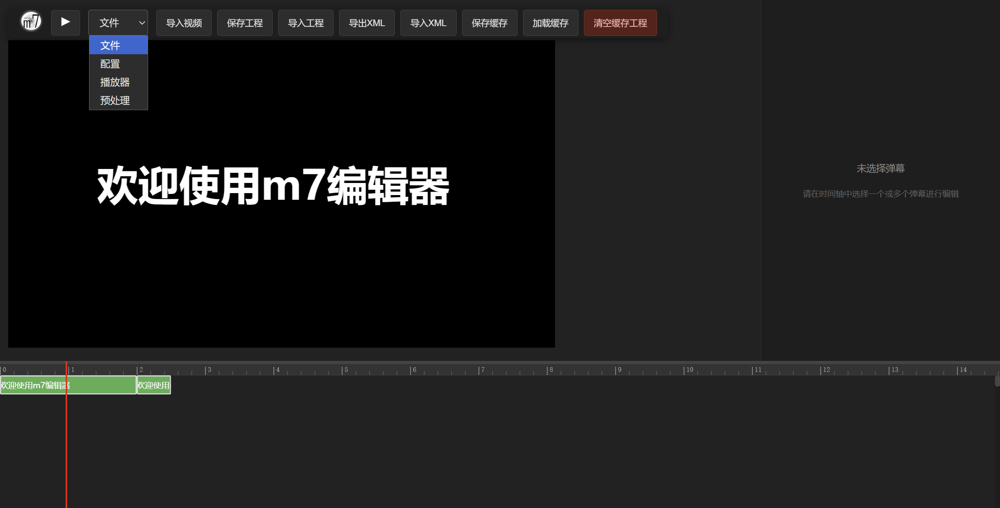

<font size="10">   m7-editor</font>


m7-editor是一个面向 M7 / B 站特效弹幕场景的可视化编辑器。  
它提供视频预览、时间轴排布、批量属性编辑、工程保存，以及 XML / JSON 导入导出能力，适合用于编辑带有位移、透明度、旋转、描边、分层的高级弹幕。

## 项目概要

这个项目目前已经具备以下核心能力：

- 本地导入视频并在播放器中预览弹幕效果
- 在时间轴中创建、选择、拖动、缩放、框选弹幕块
- 批量编辑弹幕的文本、字体、颜色、透明度、坐标、旋转、时长、延迟、缓动等参数
- 支持工程保存到本地缓存、导出工程 JSON、导入工程 JSON
- 支持导出 XML 弹幕文件
- 支持导入 XML 弹幕文件，并在导入时自动重建 layer、避让时间冲突
- 支持按 screen 宽高进行 XML 坐标比例导入与可选比例导出
- 支持撤销 / 重做、复制 / 粘贴、播放头快速定位等编辑快捷键

## 技术栈

- Vue 3
- Vite
- Pinia
- TypeScript
- 原生 DOM / FileReader / Blob API

## 安装依赖

项目使用 `npm` 管理依赖。

```bash
npm install
```

当前主要依赖如下：

- `vue`
- `pinia`
- `vue-router`
- `vite`
- `@vitejs/plugin-vue`

建议使用较新的 Node.js 版本运行，以保证与当前 Vite 版本兼容。

## 本地运行

启动开发环境：

```bash
npm run dev
```

构建生产版本：

```bash
npm run build
```

本地预览构建结果：

```bash
npm run preview
```

## 界面说明


项目界面主要分为三部分：

### 1. 播放器区域

### 文件：
  - 导入视频
  - 播放 / 暂停
  - 保存工程到本地缓存
  - 从本地缓存加载工程
  - 导出工程 JSON
  - 导入工程 JSON
  - 导出 XML
  - 导入 XML
  - 清空缓存工程
### 配置：
| 功能 | 默认值 |
| --- | --- |
| 配置播放头步长 | 16.666667（/60） |
| 配置新建弹幕的默认生存时间 | 1000 |
| 显示`layer`层数 | 100 |
### 播放器：
| 功能 | 默认值 |
| --- | --- |
| 配置 `screen width` | 800 |
| 配置 `screen height` | 450 |
### 预处理：
| 功能 | 默认值 |
| --- | --- |
| 设置 XML 是否按比例导出 | 不勾选 |
| 设置是否对导入xml进行-50ms处理 | 勾选 |
| 设置是否对导出xml进行+50ms处理 | 勾选 |

### 2. 编辑面板

选中一条或多条弹幕后，可以直接编辑：

- Layer
- 开始时间
- 文本内容
- 字体
- 字号
- 颜色
- 描边
- 起点 / 终点坐标
- Z 轴 / Y 轴旋转
- 起止透明度
- 生存时间
- 运动时间
- 延迟
- 缓动方式

其中大部分数值输入框支持直接输入运算表达式且支持批量操作，例如：

- `1000`
- `+100`
- `-50`
- `*2`
- `/2`

颜色字段支持：

- 普通十六进制颜色：`#FFFFFF`
- 不带 `#` 的颜色：`FFFFFF`
- 对选中弹幕颜色的 Alpha 混合格式：`FFFFFF@0.5`

### 3. 时间轴区域

- 显示 100 层轨道（可自定）
- 可拖动播放头
- 可拖动弹幕块位置
- 可拉伸弹幕块左右边界以修改时间范围
- 支持 `Ctrl` 框选与多选
- 支持时间轴缩放
- 支持播放头与视图快速平移
- 支持顶部拖拽调整时间轴区域高度
- 支持在拖动弹幕时快捷移动视图

## 已实现的快捷键

以下快捷键基于当前代码实现整理，`Ctrl` 在 macOS 上可对应 `Command`。

### 播放与工程

| 快捷键 | 作用 |
| --- | --- |
| `Space` | 播放 / 暂停 |
| `Ctrl + S` | 导出工程 JSON |
| `Ctrl + D` | 保存工程到本地缓存 |
| `Ctrl + Delete` | 清空本地缓存工程 |

### 弹幕编辑

| 快捷键 | 作用 |
| --- | --- |
| `;` | 在当前播放头创建一条新弹幕 |
| `Delete` | 删除当前选中的弹幕 |
| `Ctrl + C` | 复制选中的弹幕 |
| `Ctrl + V` | 粘贴弹幕 |
| `Ctrl + Z` | 撤销 |
| `Ctrl + Y` | 重做 |
| `[` | 将播放头移动到当前操作弹幕或首个选中弹幕的开始位置 |
| `]` | 将播放头移动到当前操作弹幕或首个选中弹幕的结束位置 |
| `shift + enter` | 编辑文本字段时换行 |
| `enter` | 将弹幕数据写入 |

### 时间轴与播放头

| 快捷键 | 作用 |
| --- | --- |
| `ArrowLeft` | 按当前播放头步长向左移动播放头 |
| `ArrowRight` | 按当前播放头步长向右移动播放头 |
| `ArrowUp` | 将选中弹幕layer-1（向上移动）|
| `ArrowDown` | 将选中弹幕layer+1（向下移动） |
| `Ctrl + ArrowLeft` | 向左平移时间轴 10 秒，并同步移动播放头 |
| `Ctrl + ArrowRight` | 向右平移时间轴 10 秒，并同步移动播放头 |
| `Ctrl + Alt + ArrowLeft` | 向左平移时间轴 30 秒，并同步移动播放头 |
| `Ctrl + Alt + ArrowRight` | 向右平移时间轴 30 秒，并同步移动播放头 |
| `Ctrl + -` | 缩小时间轴视图 |
| `Ctrl + =` | 放大时间轴视图 |

## 文件导入导出说明

### 工程 JSON

用于保存编辑器工程状态，包含：

- 项目元数据
- 视频信息
- 时间轴信息
- 播放器与导出设置
- 全部弹幕数据

适合在本项目内继续编辑、备份或分享工程。

### XML 弹幕文件

用于和 B 站 XML 弹幕格式进行互通。

当前实现特性：

- 导出时会按 `startTime -> layer` 排序
- 同一 `startTime` 下会使用 fake `sendTime` 保证导出顺序
- `Microsoft YaHei` 会按项目要求做特殊格式处理
- 可按当前 `screen width/height` 将像素坐标导出为比例坐标
- 导入时会根据 XML 中的 `date/sendTime` 反推 layer 顺序
- 导入时若坐标位于 `0 <= value < 1`，会按当前 `screen width/height` 视为比例坐标并转成像素
- 导入时会额外执行时间冲突避让，避免大量弹幕挤在同一 layer
- 如果单条 XML 弹幕解析失败，会跳过该条并继续导入其他弹幕

### 粘贴弹幕

当前粘贴功能支持比早期版本更宽松的输入格式，这意味着你可以直接从导出的工程 JSON 中复制需要的弹幕内容进行粘贴。

支持的常见格式包括：

- 直接复制的弹幕数组
- 整个 `project.json`，会自动提取其中的 `danmakus`
- 单条弹幕对象
- 从 `danmakus` 数组中截取出来的若干对象片段
- 带尾逗号的 JSON 片段

粘贴后仍会自动执行：

- 新 ID 分配
- 播放头对齐的时间偏移
- layer 冲突避让

## 使用建议

推荐的基本工作流：

1. 导入视频
2. 在时间轴移动播放头到目标位置
3. 使用 `;` 创建弹幕
4. 通过拖拽和右侧属性面板调整弹幕参数
5. 使用复制、粘贴、多选和批量编辑提高效率
6. 通过本地缓存或导出 JSON 保存工程
7. 最终导出 XML 用于实际使用

## 项目结构

```text
│   .gitattributes
│   .gitignore
│   index.html
│   LICENSE
│   m7_Editor.bat                    #快速启动脚本
│   package-lock.json
│   package.json
│   README.md
│   tsconfig.json
│   tsconfig.node.json
│   vite.config.js
│
├───public
│       favicon.svg
│
└───src
    │   App.vue
    │   main.js
    │
    ├───components
    │   ├───editor
    │   │       editorPanel.vue      #编辑面板
    │   │
    │   ├───player
    │   │       DanmakuLayer.vue     #弹幕渲染
    │   │       Player.vue           #播放器渲染
    │   │
    │   └───timeline
    │           timeline.vue         #时间轴模块
    │
    ├───core
    │       converter.ts             #解析xml
    │       danmaku.ts               #弹幕数据结构
    │       history.ts               #快照管理
    │       player.ts                #播放器播放状态
    │       project.ts               #工程文件结构
    │
    ├───localStorage
    │       projectStorage.ts        #工程文件保存/加载
    │
    ├───store
    │       editor.ts                #Pinia 状态管理
    │
    └───utils
            parser.ts                #校验工具
            time.ts                  #时间格式化工具
            validation.ts            #验证工具
```

## 当前注意事项

- 视频导入基于浏览器本地文件能力，刷新页面后需要重新选择视频文件
- 本地缓存工程依赖浏览器 `localStorage`
- XML 导入可能出现问题，请不要高估解析工具
- 弹幕数量过多会很卡很卡（待优化）
- 弹幕渲染依旧不完全还原b站（望大佬相助）
- XML 比例坐标导入导出依赖当前播放器设置中的 `screen width/height` **若要使用请提前修改宽高！否则转为坐标时会与预期不符！**

## 联系作者

<a href="https://space.bilibili.com/108382388"></a><font size="5">https://space.bilibili.com/108382388</font>
- QQ
  - 邮箱：1968029490@qq.com
  - 弹幕art研究社：[1006093326](https://qm.qq.com/q/4T5woMsPY4)
  - 作者的小群：[710815012](https://qm.qq.com/q/3exSBilgmk)

## License

MIT License
