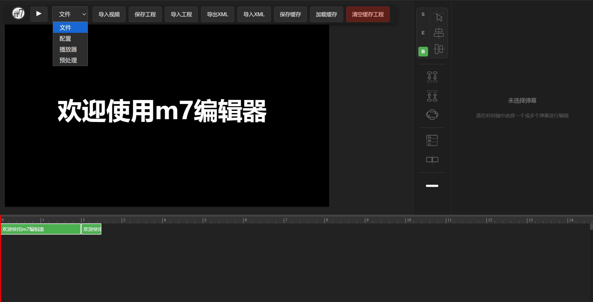
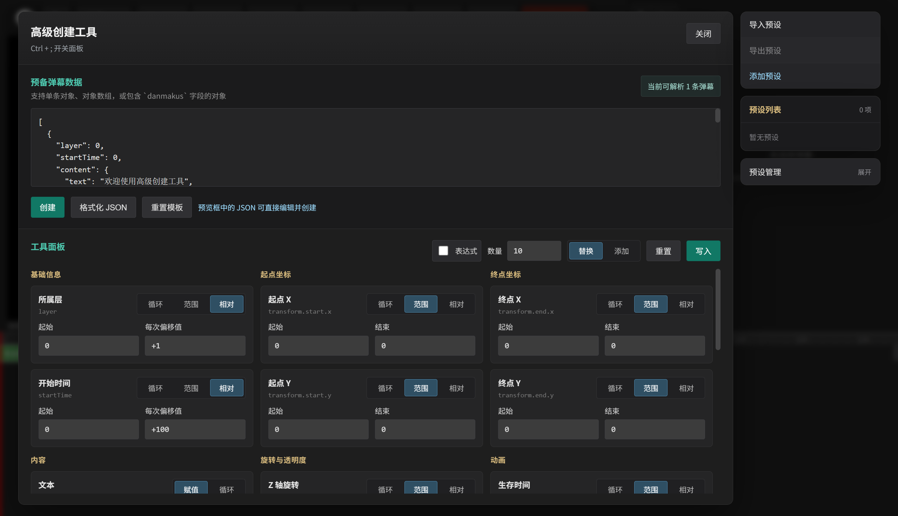

<div align="center">
  <h1>m7-editor<h1>

  
  <h3>m7-editor是一个面向 M7 / B 站特效弹幕场景的可视化编辑器</h3>
  <h3>提供音视频预览、时间轴排布、批量属性编辑、工程保存，以及 XML 导入导出能力</h3>

</div>

# 项目概要

这个项目目前已经具备以下核心能力：

- 本地导入视频/音频并在播放器中预览弹幕效果
- 在时间轴中创建、选择、拖动、缩放、框选弹幕块
- 批量编辑弹幕的文本、字体、颜色、透明度、坐标、旋转、时长、延迟、缓动等参数
- 支持工程保存到本地缓存、导出工程 JSON、导入工程 JSON
- 支持导出 XML 弹幕文件
- 支持导入 XML 弹幕文件，并在导入时自动重建 layer、避让时间冲突
- 支持按 screen 宽高进行 XML 坐标比例导入与可选比例导出
- 支持通过高级创建工具批量生成弹幕 JSON
- 支持撤销 / 重做、复制 / 粘贴、播放头快速定位等编辑快捷键

# 技术栈


[](https://vuejs.org/)
[](https://vitejs.dev/)
[](https://pinia.vuejs.org/)
[](https://www.typescriptlang.org/)
<a href="https://mathjs.org/"></a>
原生 DOM / FileReader / Blob API

# 安装依赖

项目使用 `npm` 管理依赖。

```bash
npm install
```

当前主要依赖如下：

- `vue`
- `pinia`
- `vue-router`
- `vite`
- `mathjs`
- `@vitejs/plugin-vue`

建议使用较新的 Node.js 版本运行，以保证与当前 Vite 版本兼容。

## 本地运行

启动开发环境：

```bash
npm run dev
```

构建生产版本：

```bash
npm run build
```

本地预览构建结果：

```bash
npm run preview
```
<a href="https://v2.tauri.app/"></a>

使用tauri构建应用：

```bash
npm run tauri build
```

启用tauri开发环境：

```bash
npm run tauri dev
```

# 界面说明


项目界面主要分为以下区域：

## 1. 播放器区域

### 文件：
  - 导入媒体
  - 播放 / 暂停
  - 导出工程 JSON
  - 导入工程 JSON
  - 导出 XML
  - 导入 XML
  - 保存工程到本地缓存
  - 从本地缓存加载工程
  - 清空缓存工程
### 配置：
| 功能 | 默认值 |
| --- | --- |
| 配置播放头步长 | 16.666667（/60） |
| 配置新建弹幕的默认生存时间 | 1000 |
| `layer`层数 | 100 |
### 播放器：
| 功能 | 默认值 |
| --- | --- |
| 配置 `screen width` | 800 |
| 配置 `screen height` | 450 |
| 激进优化 | 不勾选 |
### 预处理：
| 功能 | 默认值 |
| --- | --- |
| 设置 XML 是否按比例导出 | 不勾选 |
| 设置是否对导入xml进行-50ms处理 | 勾选 |
| 设置是否对导出xml进行+50ms处理 | 勾选 |
### 辅助
| 功能 | 默认值 |
| --- | --- |
| 显示频谱图 | 不勾选 |
| 频谱图上色选项 | `默认彩色` |
| 自定义颜色 | `#00bbff` |

## 2. 编辑面板

选中一条或多条弹幕后，可以直接编辑：

- Layer
- 开始时间
- 文本内容
- 字体
- 字号
- 颜色
- 描边
- 起点 / 终点坐标
- Z 轴 / Y 轴旋转
- 起止透明度
- 生存时间
- 运动时间
- 延迟
- 缓动方式

所有**数值**输入框均支持直接输入运算表达式且支持批量操作，例如：

直接赋值：
- `1000`

四则运算：
- `+100`
- `-50`
- `*2`
- `/2`

随机赋值范围：
- `r+50` `r-30` `r100`

颜色字段支持：

- 普通十六进制颜色：`#FFFFFF`
- 不带 `#` 的颜色：`FFFFFF`
- 对选中弹幕颜色的 Alpha 混合格式：`FFFFFF@0.5`

## 3. 工具栏区域

选中弹幕后可点击工具栏中的图标快捷操作，所有功能均支持批量操作

### 工具列表：

#### 拾取定位工具
  - 点击工具图标后可在屏幕中单击任意位置将坐标应用
  - 点击其他位置视为放弃
  - 支持选择作用范围

#### 水平居中工具
  - 支持z轴旋转
  - 不支持y轴翻转
  - 支持选择作用范围
  - 若弹幕坐标经处理后小于0的则弹窗提醒，并钳至0

#### 垂直居中工具
  - 支持z轴旋转
  - 不支持y轴翻转
  - 支持选择作用范围
  - 若弹幕坐标经处理后小于0的则弹窗提醒，并钳至0

#### 水平镜像工具
  - 若弹幕坐标经处理后小于0的则弹窗提醒，并钳至0

#### 垂直镜像工具
  - 若弹幕坐标经处理后小于0的则弹窗提醒，并钳至0

#### 将起始坐标应用至结束坐标工具
  - 将起始坐标应用至结束坐标

#### 将结束坐标应用至起始坐标工具
  - 将结束坐标应用至起始坐标

#### 互换结束与起始坐标工具
  - 将结束与起始坐标互换

#### z轴旋转计算工具
  - 通过起始/结束坐标计算z轴旋转角度

#### 行分隔工具
  - 将有换行的弹幕拆分为多条弹幕
  - 有layer避让
  - 支持z轴旋转
  - 不支持y轴翻转
  - 若新建弹幕坐标有小于0的则弹窗提醒，并钳至0

#### 字分隔工具
  - 拆分为单个字符
  - 有layer避让
  - 支持z轴旋转
  - 不支持y轴翻转
  - 若新建弹幕坐标有小于0的则弹窗提醒，并钳至0

#### 时间分割工具
  - 以当前播放时间分割选中弹幕

### 其中拾取定位工具、水平居中工具、垂直居中工具分成一组
- 提供三个模式选项：【S】【E】【B】默认为【B】
- 选项含义为这三个工具的作用范围
- S\E\B解释：
  - S（Start），意为作用于起始坐标
  - E（End），意为作用于结束坐标
  - B（Both），意为作用于起始与结束坐标

### 高级工具列表：

#### 描边工具
- 支持选择描边宽度
- 支持输入描边颜色
- 有layer避让
- 若新建弹幕坐标有小于0的则弹窗提醒，并钳至0

#### 计算工具
- 目标角度解析：
  1. 留空则为使用选中弹幕自身的zRotate参数作为目标角度
  2. 若输入`+/-`+`数字`则以弹幕自身`zRotate值`+/-`数值`计算相对目标角度
  3. 若仅输入数字，则直接以输入值作为目标角度
- 长度应用工具
  - 通过起始坐标、输入的长度以及设置的目标角度计算结束坐标
  - 需点击`应用`应用更改
- 锁定角度功能
  - 勾选后在修改结束坐标X/Y时会根据设置的目标角度计算另一个X/Y坐标
  - 结果会被钳至0~10000
  - 支持批量操作

#### 命令工具
- 现支持输入赋值计算公式，作用范围依旧为选中的弹幕
- 格式：
  - `被赋值字段名 = 赋值计算式（支持四则）`
  - 支持使用`;`分隔设置多个赋值规则
- 可用字段（名称）：
  1. `layer`
  2. `startTime`
  3. `size`
  4. `startX`
  5. `startY`
  6. `endX`
  7. `endY`
  8. `zRotate`
  9. `yRotate`
  10. `opacityFrom`
  11. `opacityTo`
  12. `duration`
  13. `moveDuration`
  14. `delay`

## 4. 时间轴区域

- 显示 100 层轨道（可自定）
- 可拖动播放头
- 可拖动弹幕块位置
- 可拉伸弹幕块左右边界以修改时间范围
- 支持 `Ctrl` 框选与多选
- 支持时间轴缩放
- 支持播放头与视图快速平移
- 支持顶部拖拽调整时间轴区域高度
- 支持在拖动弹幕时快捷移动视图

## 5. 高级创建工具模块


通过 `Ctrl + ;` 可唤出高级创建工具。这个模块采用“工具面板生成规则 -> 写入预览 JSON -> 用户确认后点击创建”的流程，和主编辑器数据解耦，适合批量造大量弹幕。

### 预备弹幕数据区

- 提供可直接编辑的 JSON 预览框
- 支持格式化 JSON
- 支持重置为单条弹幕模板
- 点击 `创建` 后才会真正写入弹幕列表
- 写入时会自动完成字段规范化、新 ID 分配，并记录历史快照

### 工具面板

- 支持设置生成数量
- 数量输入框前提供 `表达式` 复选框，默认关闭
- 支持 `替换` 和 `添加` 两种写入预览框的方式
- 所有数值字段都支持三种生成模式：
  - `循环`：按输入列表循环取值
  - `范围`：指定第一条和最后一条弹幕的值，中间值线性均分，或由表达式控制插值方式
  - `相对`：指定起始值和每次偏移值，后续弹幕递推生成
- 当开启 `表达式` 且数值字段处于 `范围` 模式时，会额外显示该字段专属的表达式输入区
- 每个数值字段都可以单独选择表达式预设或填写自定义表达式
- 颜色字段支持三种模式：
  - `循环`：按颜色列表循环取值
  - `范围`：起始颜色到目标颜色按 `alpha 0 -> 1` 均匀混合
  - `相对`：以起始颜色和叠加颜色做混合，`alpha` 从 `0` 开始按输入值递增，直到上限 `1`
- `text`、`font`、`stroke`、`easing` 支持 `赋值` 和 `循环` 两种模式
- 循环列表统一使用 `;` 加换行分隔，最终写入预览框前才执行字段类型校验与规范化
- 点击 `写入` 后先生成 JSON 到预览框，确认无误后再点击 `创建`

### 预设管理器

高级创建工具右侧带有独立的预设管理侧边栏，用于保存、导入、导出和管理整套工具面板配置。

- `导入预设`：将 JSON 文件中的预设追加到当前列表
- `导出预设`：导出当前列表中的全部预设
- `添加预设`：将当前工具面板配置保存为一个新预设，默认命名为 `新建预设1`、`新建预设2` 依次递增
- `预设列表`：点击即把该预设应用到当前工具面板
- `预设管理`：拥有独立的管理选中状态，单击选中用于管理，再次点击同一项进入重命名，按 `Delete` 删除当前管理选中的预设

预设内容仅保存工具面板状态，不会保存预览框里的 JSON。预设列表会自动同步到浏览器 `localStorage`，也可以通过导入 / 导出在不同工程环境中迁移。

### 表达式规范

表达式功能仅作用于高级创建工具中处于 `范围` 模式的数值字段。  
字段会先按表达式计算出原始结果序列，再在写入预览框前统一做字段规范化，因此不会因为逐条钳制或取整导致递推失真。

#### 可用变量

- `S`：起始值
- `E`：结束值
- `t`：归一化进度，范围 `0 ~ 1`
- `i`：当前索引，从 `0` 开始
- `n`：生成数量
- `pi`：圆周率
- `e`：自然常数

#### 可用运算与函数

- 基础运算：`+` `-` `*` `/` `^` `()`
- 常用函数：`random` `sin` `cos` `tan` `abs` `sqrt` `min` `max` `floor` `ceil` `round` `log` `exp`
- 特殊函数：`bezier(x1, y1, x2, y2, t)`
  - 用于按三阶贝塞尔曲线计算缓动进度
  - 例如标准 ease-in-out：`bezier(0.42, 0, 0.58, 1, t)`

#### 内置表达式预设

- 线性均分：`S + (E - S) * t`
- 标准缓入缓出（Ease In Out）：`S + (E - S) * bezier(0.42, 0, 0.58, 1, t)`
- 缓入（Ease In）：`S + (E - S) * bezier(0.42, 0, 1, 1, t)`
- 缓出（Ease Out）：`S + (E - S) * bezier(0, 0, 0.58, 1, t)`
- 二次加速曲线：`S + (E - S) * t ^ 2`
- 二次减速曲线：`S + (E - S) * (1 - (1 - t) ^ 2)`
- 随机：`S + (E - S) * random()`
- 轻微回弹：`S + (E - S) * (t + 0.18 * sin(pi * t) * (1 - t))`

#### 示例

- 前半段快速变化：`S + (E - S) * sqrt(t)`
- 带轻微波动的路径：`S + (E - S) * t + 20 * sin(pi * t)`

# 已实现的快捷键

以下快捷键基于当前代码实现整理，`Ctrl` 在 macOS 上可对应 `Command`。

## 播放与工程

| 快捷键 | 作用 |
| --- | --- |
| `Space` | 播放 / 暂停 |
| `Ctrl + S` | 导出工程 JSON |
| `Ctrl + D` | 保存工程到本地缓存 |
| `Ctrl + Delete` | 清空本地缓存工程 |
| `Tab` | 手动重构缓存池 |

## 弹幕编辑

| 快捷键 | 作用 |
| --- | --- |
| `;` | 在当前播放头创建一条新弹幕 |
| `Ctrl + ;` | 唤出高级创建工具 |
| `Delete` | 删除当前选中的弹幕 |
| `Ctrl + C` | 复制选中的弹幕 |
| `Ctrl + alt + C` | 复制当前帧的弹幕，保留当前状态（通过选择弹幕定义复制范围，若没有则复制所有可见弹幕） |
| `Ctrl + V` | 粘贴弹幕 |
| `Ctrl + A` | 全选弹幕 |
| `Ctrl + Z` | 撤销 |
| `Ctrl + Y` | 重做 |
| `[` | 将播放头移动到当前操作弹幕或首个选中弹幕的开始位置 |
| `]` | 将播放头移动到当前操作弹幕或首个选中弹幕的结束位置 |
| `shift + enter` | 编辑文本字段时换行 |
| `enter` | 将弹幕数据写入 |

## 时间轴与播放头

| 快捷键 | 作用 |
| --- | --- |
| `ArrowLeft` | 按当前播放头步长向左移动播放头 |
| `ArrowRight` | 按当前播放头步长向右移动播放头 |
| `ArrowUp` | 向上移动视图一个layer宽度，若有选中的弹幕则将其layer-1（向上移动）|
| `ArrowDown` | 向下移动视图一个layer宽度，若有选中的弹幕则将其layer+1（向下移动） |
| `Ctrl + ArrowLeft` | 向左平移时间轴一半视图，并同步移动播放头 |
| `Ctrl + ArrowRight` | 向右平移时间轴一半视图，并同步移动播放头 |
| `Ctrl + Alt + ArrowLeft` | 向左平移时间轴 30 秒，并同步移动播放头 |
| `Ctrl + Alt + ArrowRight` | 向右平移时间轴 30 秒，并同步移动播放头 |
| `Ctrl + -` | 缩小时间轴视图 |
| `Ctrl + =` | 放大时间轴视图 |

# 文件导入导出说明

## 工程 JSON

用于保存编辑器工程状态，包含：

- 项目元数据
- 媒体文件信息
- 时间轴信息
- 播放器与导出设置
- 全部弹幕数据

适合在本项目内继续编辑、备份或分享工程。

## XML 弹幕文件

用于和 B 站 XML 弹幕格式进行互通。

当前实现特性：

- 导出时会按 `startTime -> layer` 排序
- 同一 `startTime` 下会使用 fake `sendTime` 保证导出顺序
- `Microsoft YaHei` 会按项目要求做特殊格式处理
- 可按当前 `screen width/height` 将像素坐标导出为比例坐标
- 导入时会根据 XML 中的 `date/sendTime` 反推 layer 顺序
- 导入时若坐标位于 `0 <= value < 1`，会按当前 `screen width/height` 视为比例坐标并转成像素
- 导入时会额外执行时间冲突避让，避免大量弹幕挤在同一 layer
- 如果单条 XML 弹幕解析失败，会跳过该条并继续导入其他弹幕
- 导出时若颜色值为0则修正至1，保证在b站不会显示错误
- 导出时若选择按比例并检测到有弹幕坐标超出显示范围，则强制修改为0.999，并弹窗提示

## 粘贴弹幕

当前粘贴功能支持比早期版本更宽松的输入格式，这意味着你可以直接从导出的工程 JSON 中复制需要的弹幕内容进行粘贴。

支持的常见格式包括：

- 直接复制的弹幕数组
- 整个 `project.json`，会自动提取其中的 `danmakus`
- 单条弹幕对象
- 从 `danmakus` 数组中截取出来的若干对象片段
- 带尾逗号的 JSON 片段

粘贴后会自动执行：

- 新 ID 分配
- 播放头对齐的时间偏移
- layer 冲突避让

# 使用建议

推荐的基本工作流：

1. 导入媒体
2. 在时间轴移动播放头到目标位置
3. 使用 `;` 创建弹幕
4. 通过拖拽和右侧属性面板调整弹幕参数
5. 使用复制、粘贴、多选和批量编辑提高效率
6. 通过本地缓存或导出 JSON 保存工程
7. 最终导出 XML 用于实际使用

# 当前注意事项

- 音视频导入基于浏览器本地文件能力，刷新页面后需要重新选择文件
- 本地缓存工程依赖浏览器 `localStorage`
- XML 导入可能出现问题，请不要高估解析工具
- 弹幕密度建议不要超过300个每秒，再高密度请开启`激进优化`
- XML 比例坐标导入导出依赖当前播放器设置中的 `screen width/height` **若要使用请提前修改宽高！否则转为坐标时会与预期不符！**
- 弹幕渲染优化采用低频确定高刷范围，若发现弹幕层级显示不正常或无法显示，请按下`Tab`键手动重构缓存池
- 若您发现修改弹幕结束坐标时不起效用，请检查您的`运动耗时`设置，这可能是因为其设置为0导致的

# 项目结构

```text
│   .gitattributes
│   .gitignore
│   index.html
│   LICENSE
│   m7_Editor.bat                    #快速启动脚本
│   package-lock.json
│   package.json
│   README.md
│   tsconfig.json
│   tsconfig.node.json
│   vite.config.js
│
├───public
│       favicon.svg
│
├───src
│   │   App.vue
│   │   main.js
│   │   style.css
│   │
│   ├───components
│   │   ├───editor
│   │   │       creationTools.vue    #高级创建工具
│   │   │       PresetManager.vue    #高级创建工具预设管理器
│   │   │       editorPanel.vue      #编辑面板
│   │   │       ToolBar.vue          #工具栏
│   │   │
│   │   ├───player
│   │   │       DanmakuLayer.vue     #弹幕渲染
│   │   │       Player.vue           #播放器渲染
│   │   │
│   │   └───timeline
│   │           timeline.vue         #时间轴模块
│   │
│   ├───core
│   │       converter.ts             #解析xml
│   │       danmaku.ts               #弹幕数据结构
│   │       history.ts               #快照管理
│   │       player.ts                #播放器播放状态
│   │       project.ts               #工程文件结构
│   │
│   ├───icon                         #工具栏图标
│   │       ...
│   │
│   ├───localStorage
│   │       projectStorage.ts        #工程文件保存/加载
│   │
│   ├───store
│   │       editor.ts                #Pinia 状态管理
│   │
│   └───utils
│           danmakuGenerator.ts      #高级创建工具生成算法
│           parser.ts                #解析工具
│           tauriMedia.ts            #媒体文件路径
│           time.ts                  #时间格式化工具
│           toolPresets.ts           #高级创建工具预设读写
│           validation.ts            #验证工具
│
└───src-tauri
    │   .gitignore
    │   build.rs
    │   Cargo.lock
    │   Cargo.toml
    │   tauri.conf.json              #构建配置
    │
    ├───capabilities
    │       default.json
    │
    ├───icons                        #应用图标
    │       ...
    │
    └───src                          #后端
         lib.rs
         main.rs
```

# 联系作者

<a href="https://space.bilibili.com/108382388"></a><font size="5">https://space.bilibili.com/108382388</font>
- QQ
  - 邮箱：1968029490@qq.com
  - 弹幕art研究社：[1006093326](https://qm.qq.com/q/4T5woMsPY4)
  - 作者的小群：[710815012](https://qm.qq.com/q/3exSBilgmk)

# License

MIT License
